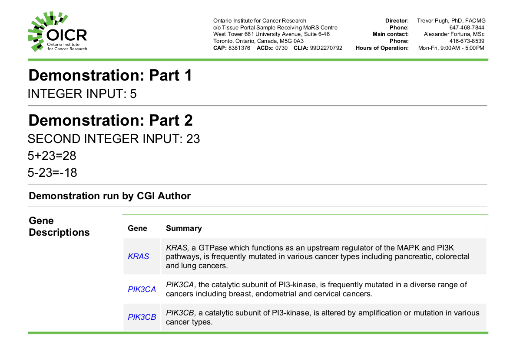
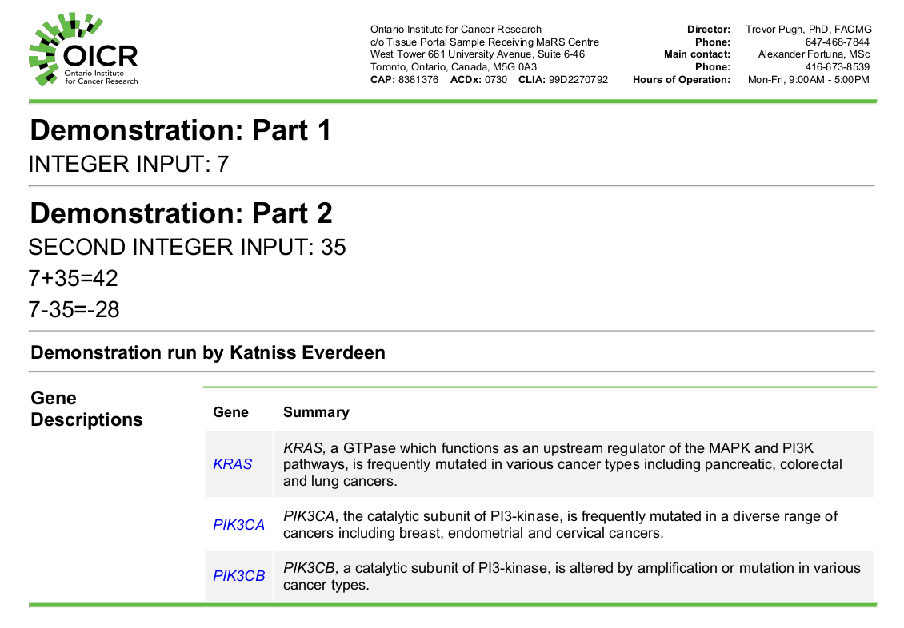

# How to use djerba-demo

## Introduction

This document contains detailed instructions for how to install, test, and run [djerba-demo](https://github.com/oicr-gsi/djerba-demo).

## Requirements

### Hardware

- `djerba-demo` is a lightweight demonstration; 4 GB of RAM and a 1 GHz processor should be more than sufficient.

### Operating system

- Djerba runs in production under Ubuntu 20.04 LTS.
- Other versions of Linux should work with no difficulty.
- Limited testing of Djerba has successfully been carried out on MacOS.
- Djerba has _not_ been tested on Windows, and issues are likely to occur.
- If you do not have access to a Linux machine, we recommend setting up an Ubuntu VM in [VirtualBox](https://www.virtualbox.org/) to run `djerba-demo`.

### Software

- [Python](https://www.python.org/downloads/) version 3.10 or greater
- The [wkhtmltopdf](https://wkhtmltopdf.org/downloads.html) binary must be on the system `PATH`.
- For best results, the Arial font family should be installed (in `$HOME/.local/share/fonts` on a Linux machine).
- That's it! Production plugins at OICR have additional dependencies, but `djerba-demo` is intended to be as lightweight as possible.

## Installation

### 1. Set up and activate a Python virtual environment

We recommend installing Djerba to a [Python virtual environment](https://docs.python.org/3/library/venv.html), instead of the system Python directory.
- Choose a directory `$MY_VENV_DIR` in which to make your venv
- The `python3` command may be the system Python, or it may be a version of Python installed separately; the only requirement is for the Python version to be 3.10 or greater.
- Proceed to set up and activate the venv as follows:

```
cd $MY_VENV_DIR
mkdir djerba-demo
python3 -m venv djerba-demo
source djerba-demo/bin/activate
```

### 2. Clone or download the djerba-demo repository

```
git clone git@github.com:oicr-gsi/djerba-demo.git
cd djerba-demo
```

Alternatively:
```
wget https://github.com/oicr-gsi/djerba-demo/archive/refs/heads/main.zip
unzip main.zip
cd djerba-demo-main
```

### 3. Install using pip

- [pip](https://pypi.org/project/pip/) is the standard package installer for Python.
- The following command will install Djerba into your virtual environment.

```
pip3 install .
```

## Testing

Run the Djerba core tests to ensure the installation is working properly.

```
source ./src/test/test_env.sh
./src/test/core/test_core.py
```

You should see something like this:

```
.................................
----------------------------------------------------------------------
Ran 33 tests in 2.994s

OK
```

## Generating a report

We can now generate a Djerba report. This will be done with two very simple _plugins_ called `demo1` and `demo2`; and a _merger_ called `gene_information_merger`. A merger is a component which merges, deduplicates, and renders output from one or more plugins.

We will set up a working directory; edit a config file with values of our choice; and generate a PDF report.

### 1. Set up a working directory

- Choose an appropriate directory for Djerba input and output files.
- Djerba uses a workspace directory to write intermediate output files; it can be anywhere, but we will put it in a subdirectory called `work`.

```
cd $MY_TEST_DIR
mkdir work
```

### 2. Generate and edit an INI config file

- We use Djerba in `setup` mode to generate a blank INI config file.

```
djerba.py setup --assay DEMO --compact
```

You will now see a file called `config.ini` with the following contents:

```
[core]

[demo1]
integer = REQUIRED

[demo2]
integer_2 = REQUIRED

[gene_information_merger]
```

The file is in the standard INI config format, as implemented in the Python [ConfigParser module](https://docs.python.org/3/library/configparser.html#supported-ini-file-structure). We can see it has sections for the Djerba core, two plugins and a merger. Let us fill in appropriate values:

```
[core]

[demo1]
integer = 5

[demo2]
integer_2 = 23

[gene_information_merger]
```

### 3. Create a Djerba report

We can generate a report with this command:

```
djerba.py --verbose report --ini config.ini --out-dir work --no-archive --pdf
```

Some explanation of the options:
- `--verbose` writes additional logging information to the terminal
- `--ini` and `--out-dir` are the INI config and output directory, respectively
- `--no-archive` omits upload of the report to a database, since we haven't set that up
- `--pdf` generates a PDF document

You should see logging output, concluding with something like:
```
2024-07-09_16:52:00 djerba.core.main INFO: Wrote HTML output to work/OICR-CGI-7421acae21f34612a2fc66a1bd02671e_report.clinical.html
2024-07-09_16:52:00 djerba.core.render INFO: Writing PDF to work/OICR-CGI-7421acae21f34612a2fc66a1bd02671e_report.clinical.pdf
2024-07-09_16:52:01 djerba.core.render INFO: Finished writing PDF
2024-07-09_16:52:01 djerba.core.main INFO: Wrote PDF output to work/OICR-CGI-7421acae21f34612a2fc66a1bd02671e_report.clinical.pdf
2024-07-09_16:52:01 djerba.core.main INFO: Finished Djerba render step
```

Note the somewhat unwieldy filename `OICR-CGI-7421acae21f34612a2fc66a1bd02671e_report.clinical.pdf`. The filename derives from an optional `report_id` parameter -- if none is specified, Djerba generates a globally unique identifier. How to modify this is further discussed below.

### 4. View the HTML/PDF

The `report` command above has written HTML and PDF report documents in the `work` directory, which should look like this:



### 5. View the JSON

Djerba writes a machine-readable JSON file which is used to generate the HTML and PDF. It can also be stored in a database, parsed and queried by other scripts.

We can view the JSON as follows (substituting the unique filename of your report):
```
cat report/OICR-CGI-7421acae21f34612a2fc66a1bd02671e_report.json | python3 -m json.tool | less
```

- Example JSON is shown below.
- Djerba has a flexible structure, in which each plugin can record arbitrary JSON data in its `results` attribute.
- The `merge_inputs` section has inputs for the `gene_information_merger` which was listed in our INI config file.
- The `priorities` section controls the order in which plugins are run, and assembled into a document.
- The `attributes` section allows us to specify various report types, such as clinically-accredited and research-only.

```
{
    "core": {
        "author": "CGI Author",
        "document_config": "document_config.json",
        "report_id": "OICR-CGI-7421acae21f34612a2fc66a1bd02671e",
        "core_version": "1.6.4",
        "extract_time": "2024-07-09_16:52:00 -0400"
    },
    "plugins": {
        "demo1": {
            "plugin_name": "demo1 plugin",
            "version": "1.0.0",
            "priorities": {
                "configure": 200,
                "extract": 200,
                "render": 200
            },
            "attributes": [
                "clinical"
            ],
            "merge_inputs": {
                "gene_information_merger": [
                    {
                        "Gene": "KRAS",
                        "Gene_URL": "https://www.oncokb.org/gene/KRAS",
                        "Chromosome": "12p12.1",
                        "Summary": "KRAS, a GTPase which functions as an upstream regulator of the MAPK and PI3K pathways, is frequently mutated in various cancer types including pancreatic, colorectal and lung cancers."
                    },
                    {
                        "Gene": "PIK3CA",
                        "Gene_URL": "https://www.oncokb.org/gene/PIK3CA",
                        "Chromosome": "3q26.32",
                        "Summary": "PIK3CA, the catalytic subunit of PI3-kinase, is frequently mutated in a diverse range of cancers including breast, endometrial and cervical cancers."
                    }
                ]
            },
            "results": {
                "integer": 5
            }
        },
	...
```

### 6. More workspace files

In addition to the HTML, PDF and JSON, our working directory contains two other files.

#### full_config.ini

This is a _fully specified_ INI configuration file, generated by Djerba at runtime.

#### integer.txt

This file was written by the `demo1` plugin, and read by the `demo2` plugin. Reading and writing files in the workspace allows Djerba components to communicate with each other. For instance, OICR uses a component to write gene expression values; another plugin identifies relevant SNVs, reads the expression values, and outputs a table which includes the expression value for each SNV. Meanwhile, yet _another_ plugin identifies relevant CNVs, and writes a different table, which also includes expression values from the expression component.

### 7. More Djerba Parameters

We have generated a very simple Djerba report; but Djerba has many more capabilities. For example, we can modify some additional parameters. Let us set the report ID and author name as follows:

```
[core]
author = Katniss Everdeen
report_id = demo_001      

[demo1]
integer = 7

[demo2]
integer_2 = 35

[gene_information_merger]
```

We save this as `config2.ini`, make a new working directory `work2`, and generate another report:

```
djerba.py --verbose report --ini config2.ini --out-dir work2 --no-archive --pdf
```

Our `work2` directory should now contain a file `demo_001_report.clinical.pdf` which looks like this:



## Conclusion

This document has walked through a simple demonstration of installing and running Djerba.

For answers to common questions, see the [FAQ](./FAQ.md) file.

Production reports at OICR use a wide range of Djerba plugins, which can do arbitrary data processing, record the results as JSON, and assemble them into a report. See the [main Djerba repository](https://github.com/oicr-gsi/djerba) and [documentation on ReadTheDocs](https://djerba.readthedocs.io/en/latest/) for additional examples and information.


## Contact us

If you need to contact the developers, please raise an issue on the [djerba-demo Github page](https://github.com/oicr-gsi/djerba-demo/issues).

