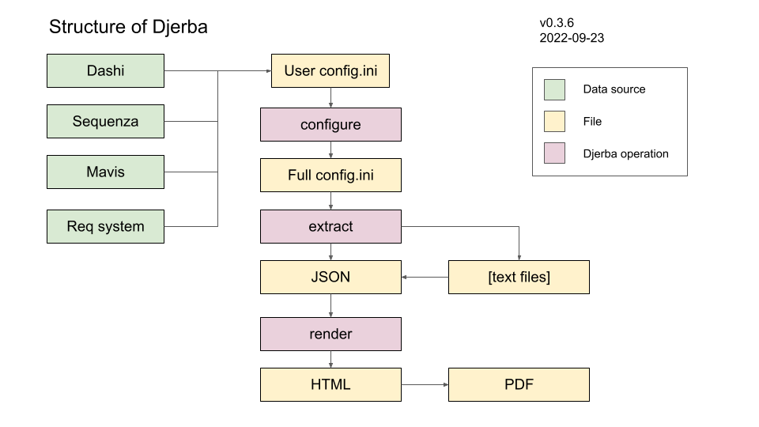

# Djerba

Create reports from metadata and workflow output

## Introduction

Djerba translates cancer bioinformatics workflow outputs and metadata into clinical reports, in the format developed by the Clinical Genome Informatics (CGI) group at [OICR](https://oicr.on.ca).

Djerba is named for an [island](https://en.wikipedia.org/wiki/Djerba) off the coast of North Africa. (The initial letter D is silent, so it is pronounced "jerba".)

Its workflow for producing a clinical report is as follows:
- Manual input to a minimal INI config file. Input sources include the OICR requisition system, OICR QC (Dashi), and workflows for Mavis and Sequenza
- `configure`: Populate a fully-specified INI config file, with defaults and automatically discovered parameters
- `extract`: Use the parameters in the INI to extract variants and metrics, and write as a JSON document
- `render`: Convert the JSON document to HTML, and HTML to PDF

## Quick start

- Run on an OICR cluster *compute node* -- not a head node, so R scripts work properly.
- See "INI configuration" below for the INI config file format.
- Load the Djerba environment module: `module load djerba`

### Examples

#### Generate a draft HTML report

`djerba.py draft --ini ${INI_INPUT_PATH} --dir ${INTERMEDIATE_OUTPUT_DIRECTORY} --html ${HTML_OUTPUT_PATH}`

#### Generate a final PDF report after updating genomic_summary.txt

`djerba.py html --dir ${INTERMEDIATE_OUTPUT_DIRECTORY} --pdf

#### Generate a QC report to accompany the clinical report

`qc_report.sh ${IDENTITY_ID} ${IDENTITY_ALIAS}`

## Command-line scripts

Run any script with `--help` for more information.

### `djerba.py`

This is the main script to run Djerba and generate reports. It has several modes, to handle the different stages of the reporting process.

Logging options are specified before the mode name, eg. `djerba.py --verbose --log-path djerba.log all ...`

#### Script modes

- `setup`: Set up an empty working directory for generating a CGI report
- `configure`: Read the INI config file supplied by the user; gather inputs from file provenance and other sources; write a fully-specified INI
- `extract`: Take a fully-specified INI as input; extract metrics and write intermediate files to a reporting directory; collate metrics into a JSON document.
- `html`: Input the JSON document produced by `extract`; write an HTML report; optionally, write the PDF report
- `pdf`: Convert HTML to PDF. For CGI reports only; see html2pdf.py for general-purpose conversion.
- `draft`: Generate a draft report, by running the configure/extract/html steps in sequence to output a reporting directory and HTML document. The draft output can then be edited, prior to running in `html` mode again to regenerate the html and produce a final PDF report.
- `all`: Run the complete reporting process, starting with user-supplied INI and finishing with PDF.

#### INI configuration

The `configure`, `extract`, `draft` and `all` modes require an INI configuration file. Some parameters are required, while others are optional.

Documentation of file format and required parameters: [ini.md](./doc/ini.md)

Example INI file (with dummy value for the `mavis_file` parameter): [config_user.ini](./src/test/data/config_user.ini)

### `benchmark.py`

Automatically find inputs and generate reports for the GSICAPBENCH dataset. Logging options are the same as for `djerba.py`. The script has two modes.

#### `report` mode

Set up and (optionally) generate Djerba reports. Example usage:

`benchmark.py report --input-dir ${SCRATCH}/GSICAPBENCHyymmdd/seqware-results/ --output-dir $MY_OUTPUT_DIR`

#### `compare` mode

Compare two Djerba report directories. Example usage:

`benchmark.py compare --report-dir $REPORT_DIR_1 --report-dir $REPORT_DIR_2`

Note that the `--report-dir` parameter must be specified exactly twice.

The script in `compare` mode will exit with return code 1 if the reports are _NOT_ equivalent; and return code 0 otherwise.

### `html2pdf.py`

Convenience script for simple HTML to PDF conversion. Does not add the page footer used in Djerba reports.

### `list_inputs.py`

Script to list the input files for a Djerba report, eg. for export to a collaborator. The script reads the Mavis path (if any) from a config.ini file; all other paths are discovered from file provenance, as if drafting a new Djerba report from scratch.

### `qc_report.sh`

Bash script to generate a QC report, which accompanies the clinical report created by `djerba.py`.

### `sequenza_explorer.py`

Standalone script to explore available solutions in Sequenza output. (If gamma is not supplied to djerba.py, it will be found automatically.)

### `run_mavis.py`

Script to manually run the Mavis workflow, via the Cromwell development server. This will be required on a temporary basis before Mavis is added to automated CAP workflows, and later for troubleshooting.

### `update_genomic_summary.py`

Script to update the `genomic_summary` field of the Djerba report JSON, by inserting the contents of a given text file.

### `view_json.py`

Script to view the Djerba report JSON in human-readable format, by adding spaces and redacting the base64-encoded images.

## Prerequisites

The following OICR [Modulator](https://gitlab.oicr.on.ca/ResearchIT/modulator) environment modules are required:
- `python/3.9`
- `oncokb-annotator/3.3.0`
- `cbioportal/0.1`
- `rmarkdown/0.1m`
- `wkhtmltopdf/0.12.6`
- `cromwell/45.1`
- `bcftools/1.9`

In addition, the `qc_report.sh` script will unload the Python module and load `production-tools-python`, as a workaround for Python version conflicts.

Djerba has a `setup.py` script which will install its source code and Python dependencies. Production releases of Djerba will be installed as an environment modules in Modulator. Alternatively, install as described under `Installation`.

## Testing

To run the unit tests on a checkout of the Djerba repo:
- `export DJERBA_SOURCE_DIR=${PATH_TO_DJERBA_REPO}`
- `cd $DJERBA_SOURCE_DIR`
- `source src/test/test_env.sh`
- `./src/test/test.py`
- To additionally run the GSICAPBENCH tests: `./src/test/test_benchmark.py`

## Installation

- Ensure prerequisite modules are loaded and tests pass.
- Ensure an up-to-date version of [pip](https://pypi.org/project/pip/) is available.
- From the repo directory, run `pip install --prefix $INSTALL_DIR .` to install using `setup.py`. This will copy `djerba.py` to the `bin` directory, and relevant modules and data files to the `lib` directory, under the installation path `$INSTALL_DIR`.
- See `pip install --help` for further installation options.

## Development

### Repository Structure

#### Overview

- [src](./src): Production source code
- [src/bin/](./src/bin/): Scripts to run Djerba
- [src/lib/djerba](./src/lib/djerba): Python package for Djerba functions. Includes subdirectories for data files and R scripts.
- [src/test](./src/test): Tests for production code
- [prototypes](./prototypes): Development area for non-production scripts and tests

#### Contents of Djerba package directory

- Top-level python modules:
  - `benchmark.py`: Check Djerba results on benchmark input data
  - `configure.py`: Discover additional parameters for the user-supplied INI file
  - `lister.py`: List input paths for the `list_inputs.py` script
  - `main.py`: Main module to run Djerba functions
  - `mavis.py`: Manually run the Mavis workflow
  - `sequenza.py`: Process output from the Sequenza tool
  - `version.py`: Records the Djerba release version
- Python subpackages:
  - `extract`: Extract metrics for INI parameters and write as JSON
  - `render`: Render output from JSON to HTML or PDF
  - `util`: Constants and utility functions
- Other subdirectories:
  - `data`: Data files for Djerba Python classes and R scripts
  - `data/html`: Mako templates and other files for HTML generation
  - `R_plots`: R scripts for writing plots in HTML output, used by `render`
  - `R_stats`: R scripts for computing metrics, used by `extract`

### Release Procedure

- Update `CHANGELOG.md`
- Increment the version number in `version.py`
- Commit (or merge) to the master branch, and tag the release on Github
- Update environment module configuration in [OICR Modulator](https://gitlab.oicr.on.ca/ResearchIT/modulator) to install the newly tagged release
- Save an updated copy of GSICAPBENCH test data and update the symlink `/.mounts/labs/CGI/gsi/djerba_test/GSICAPBENCH_djerba_latest`, if necessary
- Tag and release an updated version of [djerba_test_data_lfs](https://bitbucket.oicr.on.ca/gsi/djerba_test_data_lfs.git), if necessary

### Development History

- **2019-01 to 2020-09**: The [cbioportal_tools](https://github.com/oicr-gsi/cbioportal_tools) project, also known as Janus, was a precursor to Djerba. This project was intended to produce reporting directories for [cBioPortal](https://cbioportal.org/).
- **2020-09**: The Djerba repository is created to replace `cbioportal_tools`. Its scope includes CGI clinical reporting as well as cBioPortal. Development releases, up to and including 0.0.4, address both output formats.
- **2021-05**: The scope of Djerba changes, to focus exclusively on CGI clinical reports and drop support for cBioPortal. Major overhaul and simplification of code, prior to release 0.0.5. Data processing for cBioPortal remains an option for the future.
- **2022-01**: Production release of Djerba for CGI reports.

## Copyright and License

Copyright (C) 2020, 2021, 2022 by Genome Sequence Informatics, Ontario Institute for Cancer Research.

Licensed under the [GPL 3.0 license](https://www.gnu.org/licenses/gpl-3.0.en.html).
