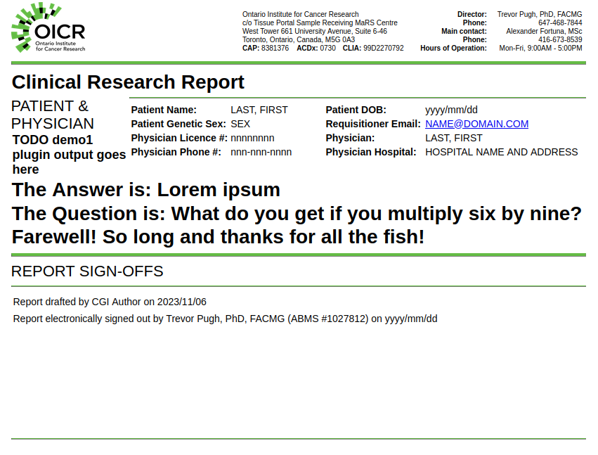

(getting_started)=

# Getting started

## Welcome to Djerba!

Djerba was developed by and for the CGI team at [OICR](https://oicr.on.ca/); but its modular plugin structure is intended to enable external collaboration.

In other words: You are welcome to write your own plugins!

Support for external development is a work in progress. Known issues are listed on [Github](https://github.com/oicr-gsi/djerba/issues); feel free to [contact](contact) the Djerba developers with any additional questions or concerns.

## Requirements

The Djerba core is written in pure Python. Minimum required version of Python is `3.10`.

Djerba is developed and tested using [Ubuntu 20.04 LTS](https://releases.ubuntu.com/focal/). Alternative operating systems such as other Linux distributions, MacOS, and Windows might work but are not supported.

Plugins are designed for flexibility, and can do any data processing the user desires. As such, they are likely to have additional dependencies. For example, several plugins developed by CGI use the [R language](https://www.r-project.org/about.html).

## Installation

Djerba has a [setup.py script](https://packaging.python.org/en/latest/guides/distributing-packages-using-setuptools/#setup-py) and can be installed using [pip](https://packaging.python.org/en/latest/tutorials/installing-packages/).

Djerba may be installed in a Python [virtual environment](https://docs.python.org/3/library/venv.html). Alternatively, it may be installed as a normal Python package in a location of the user's choice.

### Example installation in a virtual environment

```
wget https://github.com/oicr-gsi/djerba/archive/refs/tags/v1.0.0.tar.gz
tar -xzf djerba-1.0.0.tar.gz
python3 -m venv djerba-1.0.0-venv
source djerba-1.0.0-venv/bin/activate
cd djerba-1.0.0
pip3 install .
```

## Djerba scripts

Djerba contains a number of executable scripts, any of which may be run with `--help` for instructions:
- `benchmark.py`
- `djerba.py`
- `generate_ini.py`
- `sequenza_explorer.py`
- `update_oncokb_cache.py`
- `validate_plugin_json.py`

## Running the demo plugins

We can start by generating an INI file to run the demonstration plugins. The Djerba script `generate_ini.py` supports this:

```
generate_ini.py -o config.ini demo1 demo2 demo3
```

This will write a `config.ini` file in the current directory. Open the file in a text editor, and fill in whatever values you choose for the parameters listed as `REQUIRED`.

Now create a directory for working files, and run Djerba to generate a report:
```
mkdir report
djerba.py --verbose report -i config.ini -o report/ --pdf --no-archive
```

### Command-line output

Command-line output should look like this:
```
$ djerba.py --verbose report -i config.ini -o report/ --pdf --no-archive 
2023-11-06_12:58:21 djerba.core.main INFO: Validating paths in command-line arguments
2023-11-06_12:58:21 djerba.core.main INFO: Command-line path validation finished.
2023-11-06_12:58:21 djerba.core.main INFO: Running Djerba version 1.0.0
2023-11-06_12:58:21 djerba.core.main INFO: Starting Djerba config step
2023-11-06_12:58:21 djerba.core.configure INFO: Validating minimal config for component core
2023-11-06_12:58:21 djerba.core.configure INFO: Validating fully-specified config for component core
2023-11-06_12:58:21 djerba.core.configure INFO: Validating minimal config for component demo1
2023-11-06_12:58:21 djerba.core.configure INFO: Validating fully-specified config for component demo1
2023-11-06_12:58:21 djerba.core.configure INFO: Validating minimal config for component demo2
2023-11-06_12:58:21 djerba.core.configure INFO: Validating fully-specified config for component demo2
2023-11-06_12:58:21 djerba.core.configure INFO: Validating minimal config for component demo3
2023-11-06_12:58:21 djerba.core.configure INFO: Validating fully-specified config for component demo3
2023-11-06_12:58:21 djerba.core.main INFO: Finished Djerba config step
2023-11-06_12:58:21 djerba.core.main INFO: Starting Djerba extract step
2023-11-06_12:58:21 djerba.core.configure INFO: Validating fully-specified config for component demo1
2023-11-06_12:58:21 djerba.core.configure INFO: Validating fully-specified config for component demo2
2023-11-06_12:58:21 djerba.core.configure INFO: Validating fully-specified config for component demo3
2023-11-06_12:58:21 djerba.core.main INFO: Omitting archive upload at extract step
2023-11-06_12:58:21 djerba.core.main INFO: Finished Djerba extract step
2023-11-06_12:58:21 djerba.core.main INFO: Starting Djerba render step
2023-11-06_12:58:21 djerba.core.main WARNING: Default author name "CGI Author" is in use; if this is a production report, name MUST be set to an authorized individual
2023-11-06_12:58:21 djerba.core.render INFO: Assembling HTML report document: clinical
2023-11-06_12:58:21 djerba.core.render INFO: Omitting empty report document: research
2023-11-06_12:58:21 djerba.core.render INFO: Omitting empty report document: simple
2023-11-06_12:58:21 djerba.core.main INFO: Wrote HTML output to report/OICR-CGI-602c2791505e40ee847baf6b9fd65909_report.clinical.html
2023-11-06_12:58:21 djerba.core.render INFO: Writing PDF to report/OICR-CGI-602c2791505e40ee847baf6b9fd65909_report.clinical.pdf
2023-11-06_12:58:22 djerba.core.render INFO: Finished writing PDF
2023-11-06_12:58:22 djerba.core.main INFO: Wrote PDF output to report/OICR-CGI-602c2791505e40ee847baf6b9fd65909_report.clinical.pdf
2023-11-06_12:58:22 djerba.core.main INFO: Finished Djerba render step
```

If all has gone well, the `report` directory will contain a document called `djerba_report.json`, as well as HTML and PDF files with output from the demonstration plugins. Unless otherwise configured, the HTML and PDF filenames will be a [UUID](https://en.wikipedia.org/wiki/Universally_unique_identifier) prefixed with `OICR-CGI`, and with an approprate file type suffix.

### HTML and PDF output

HTML output should look like this, with possible variation according to your chosen INI settings:


PDF output will be similar.

Generating output without the OICR header, and with alternate stylesheets and formatting, is TODO. Hooks are present for this in the Djerba code, but not supported as of `v1.0.0`.

### JSON output

The `djerba_report.json` file contains a machine-readable version of the report, and should look like this: [](example_demo_json)

## Running core tests

The Djerba core functions have a suite of Python [unit tests](https://docs.python.org/3/library/unittest.html). Individual Djerba plugins have their own distinct tests.

### Workaround for `validate_json.py`

The `validate_plugin_json.py` script is required for tests, but was omitted from setup in `v1.0.0`. This will be fixed in the next release. As a workaround, put the script source on the `PATH` environment variable, for example:
```
export PATH=$PWD/djerba-1.0.0/src/bin:$PATH
```
### Database configuration

The core tests assume the user has configured a CouchDB instance where report JSON files will be uploaded. Tests can still be run without this; see [](tests_without_database).

The upload parameters _must_ be in a file named `archive_config.ini` in a directory denoted by the environment variable `DJERBA_PRIVATE_DIR`, and specified as follows:

```
[archive]
username = foo
password = bar
address = 123.123.123.123
port = 6000
```

### Expected test output

Expected output from successful tests is as follows:

```
$ ./src/test/core/test_core.py -v
test_configure (__main__.TestArgs) ... ok
test_extract (__main__.TestArgs) ... ok
test_processor (__main__.TestArgs) ... ok
test_render (__main__.TestArgs) ... ok
test_report (__main__.TestArgs) ... ok
test_plugin (__main__.TestConfigExpected)
Test config generation for a single plugin ... ok
test_attributes (__main__.TestConfigValidation) ... ok
test_optional (__main__.TestConfigValidation) ... ok
test_required (__main__.TestConfigValidation) ... ok
test_simple (__main__.TestConfigValidation) ... ok
test_get_set_has (__main__.TestConfigWrapper) ... ok
test_default (__main__.TestCoreConfigurer)
Test default configuration with UUID ... ok
test_sample_info (__main__.TestCoreConfigurer)
Test configuration with sample info file ... ok
test_depends_configure (__main__.TestDependencies) ... ok
test_depends_extract (__main__.TestDependencies) ... ok
test_class (__main__.TestIniGenerator) ... ok
test_script (__main__.TestIniGenerator) ... ok
test_plugin (__main__.TestJSONValidator) ... ok
test_plugin_broken (__main__.TestJSONValidator) ... ok
test_script (__main__.TestJSONValidator) ... ok
test_configure_cli (__main__.TestMainScript) ... ok
test_extract_cli (__main__.TestMainScript) ... ok
test_render_cli (__main__.TestMainScript) ... ok
test_report_cli (__main__.TestMainScript) ... ok
test (__main__.TestModuleDir) ... ok
test_configure_priority (__main__.TestPriority) ... ok
test_extract_priority (__main__.TestPriority) ... ok
test_render_priority (__main__.TestPriority) ... ok
test_report (__main__.TestSimpleReport) ... ok
test (__main__.TestWorkspace) ... ok

----------------------------------------------------------------------
Ran 30 tests in 14.603s

OK
```

(tests_without_database)=
### Running without a database

Support for running the core tests without a database instance is TODO.

Meanwhile, the tests _can_ be run with a dummy database INI, such as the example above.

In this case, the archive tests will eventually time out, with final output of the form:
```
----------------------------------------------------------------------
Ran 30 tests in 393.724s

FAILED (errors=3)
```

## Writing your own plugins

As of Djerba v1.0.0, plugins are required to be part of the `djerba.plugins` package. Making this more flexible is TODO.

In the meantime, the recommended way to write your own plugins is to fork the Djerba repository and write plugin code in your own fork, using the [](plugin_developers_guide) and [](plugin_methods) to help. Existing plugins provide a wide range of examples.