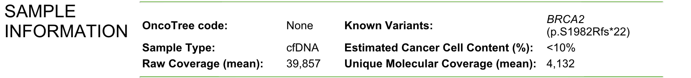

# Plugins, Helpers, and Mergers in Baseline Djerba


## Plugin, Helper, and Merger directory

In the following section, we list the plugins that are in the Djerba mainline, show an example of what they could look like, and indicate what INI configuration must exist.

Many plugins pull their values from helpers, e.g. `input_params_helper`, `tar_input_params_helper`, and `provenance_helper`. This reduces the amount of configuration each specific plugin requires, to the point where many need only the section in the config file to fully work. See the end of this document for some example INI files.

Most of these plugins rely on internal OICR infrastructure, including lookup tables, APIs, and other services to work in an automatic way. If using these plugins outside of OICR, you will need to fully specify file paths in the INI. Supplying these values in the INI will override any lookup. However, this has not been extensively tested outside the institute. Please file a ticket if you encounter any issues.

### captiv8

Research-only plugin for generating CAPTIV8 scores.


Minimum required:
* no INI parameters required

Full INI:
```
tumour_id = NVRIA-PM-1234_RB-2746_A2
oncotree_code = HCC
site_of_biopsy = Liver
primary_cancer = Hepatocellular Carcinoma
rsem_file = NVRIA_1234_Lv_P_WT_NVRIA-PM-1234_RB-2746_A2.genes.results
cibersort_file = NVRIA_1234_Lv_P_WT_NVRIA-PM-1234_RB-2746_A2.immunedeconv_CIBERSORT-Percentiles.csv
maf_file = NVRIA_1234_Lv_P_WG_NVRIA-PM-1234_RB-2746_A2.mutect2.filtered.maf.gz
virus_file = NVRIA_1234_Lv_P_WG_NVRIA-PM-1234_RB-2746_A2.virusbreakend.vcf.summary.tsv
report_dir = report/
is_hemeotological_cancer = False
```

### case_overview

Plugin to generate the Case Overview report section

WGTS


TAR


Uses `input_params.json` and/or `sample_info.json` for assay configuration.


```
assay = TAR
assay_description = Targeted Sequencing - REVOLVE Panel - cfDNA and Buffy Coat (v2.0)
primary_cancer = None
site_of_biopsy = cfDNA
donor = CTDL_123
study = CTDL
patient_study_id = PTHN-1-23
tumour_id = PTHN-1-23-01
normal_id = PTHN-1-23-01
report_id = CTDLEFT-761-v1
requisition_approved = 2185-07-18
```

### cnv 

Plugin for whole-genome CNV reporting using Sequenza (deprecated)

```
sequenza_path
sequenza_gamma
sequenza_solution
purity
purity_check
tumour_id
oncotree_code 
```
- [Test CNV Plugin](oumaima_cnv.md)


### core

The base Djerba plugin. Required!

```
author = John Sheppard
report_id = CTDLEFT-761-v1
report_version = 1
archive_name = djerba
archive_url = http://${username}:${password}@${address}:${port}
input_params = input_params.json
document_config = document_config.json
```

### expression_helper

Helper to write expression data, for use by SNV/indel and CNV plugins.

Full INI:
```
tcga_data = RODiC/data
gep_reference = gep_reference.txt.gz
enscon = ensemble_conversion_hg38.txt
gene_list = targeted_genelist.txt
rsem_genes_results = OMGA_234_Bm_P_WT_OMGA-234-T0-OZ.genes.results
tcga_code = TCGA_ALL_TUMOR
tumour_id = OMGA-234-T0-OZ
```

### fusion

Plugin to generate the Fusions and Structural Variant report section using results from MAVIS and Arriva, as well as OncoKB.


Full INI:
```
mavis_path = OMGA_234_Bm_P_OMGA-234-T0-OZ.mavis_summary.tab
arriba_path = OMGA_234_Bm_P_WT_OMGA-234-T0-OZ.fusions.tsv
tumour_id = OMGA-234-T0-OZ
oncotree_code = PCM
entrez conv path = entrez_conversion.txt
minimum fusion reads = 20
apply cache = False
update cache = False
oncokb cache = oncokb_cache/scratch
```

### gene_information_merger

When multiple plugins report actionable genes, this merger will assist in combining them together.


### genomic_landscape
Plugin for genomic landscape section, use microsatellite instability, homologous recombination deficiency status, tumour mutation burden, and any circulating tumour DNA information to compare this tumour against others available in TCGA.


Full INI
```
tumour_id = OMGA-234-T0-OZ
oncotree_code = PCM
tcgacode = TCGA_ALL_TUMOR
purity = 0.81
msi_file = OMGA_234_Bm_P_WG_OMGA-234-T0-OZ.filter.deduped.recalibrated.msi.booted
ctdna_file = SNP.count.txt
hrd_path = OMGA_234_Bm_P_WG_OMGA-234-T0-OZ.signatures.json
sample_type = Methanol Fixed
oncokb cache = oncokb_cache/scratch
apply cache = False
update cache = False
clinical = True
supplementary = False
```

### input_params_helper

Creates a JSON file `input_params.json` that has general purpose values for all non-TAR assays.

Assay can be specified by:
- Short name, which looks up in a table of known assays
- Full name -- if this parameter is set manually, the short name is ignored
Typically the short name will be used, but the full name is supported as an INI parameter
in case assay names are introduced/changed at short notice

Full list of assays is available at src/lib/djerba/util/assays.py

Minimum INI for WGTS
```
assay = WGTS
donor = OMGA_234
oncotree_code = PCM
primary_cancer = Multiple myeloma
project = OMGA
requisition_approved = 2185-06-13
requisition_id = OMGA-567
sample_type = Methanol Fixed
site_of_biopsy = Bone marrow
study = OMGA
tcgacode = TCGA_ALL_TUMOR
```

### patient_info
Generate the "Patient & Physician Info" report section.


Complete
```
patient_name = LAST, FIRST
patient_dob = YYYY-MM-DD
patient_genetic_sex = SEX
requisitioner_email = NAME@domain.com
physician_licence_number = nnnnnnnn
physician_name = LAST, FIRST
physician_phone_number = nnn-nnn-nnnn
hospital_name_and_address = HOSPITAL NAME AND ADDRESS
```

### pwgs.analysis
Plasma whole genome Mutational Sampling section


Full INI:
```
results_file = MASS_67_Pl_T_PG_MASS-069_plasma.mrdetect.txt
vaf_file = MASS_67_Pl_T_PG_MASS-069_plasma.mrdetect.vaf.txt
hbc_file = MASS_67_Pl_T_PG_MASS-069_plasma.HBCs.csv
```

### pwgs.case_overview
Plasma whole genome sequencing case overview section.


Partial INI:
```
primary_cancer = Pancreatic Adenocarcinoma
requisition_approved = 2185/05/28
wgs_report_id = MASS-672
```

Full INI
```
donor = MASS_67
group_id = MASS-069_plasma
patient_study_id = MASS-069
study_title = MASS
```

### pwgs.sample

Plasma Whole Genome Sequencing Sample QC section


Full INI:
```
qcetl_cache = qcetl_v1
bamqc_results = MASS_67_Pl_T_PG_MASS-069_plasma_bamQC.bamQC_results.json
results_file = MASS_67_Pl_T_PG_MASS-069_plasma.mrdetect.txt
candidate_snv_count = SNP.count.txt
coverage = 31
median_insert_size = 165
```

### pwgs.summary

Plasma Whole Genome Sequencing Summary section


Full INI:
```
results_file = MASS_67_Pl_T_PG_MASS-069_plasma.mrdetect.txt
```

### pwgs_cardea_helper

Provide:
```
requisition_id = MASS-EFT-673
```

Full INI:
```
cardea_url = https://cardea.gsi.oicr.on.ca/requisition-cases
```

### pwgs_provenance_helper

Full INI:
```
provenance_input_path = vidarr_files_report_latest.tsv.gz
project = MASS
donor = MASS_67
provenance_id = MASS_67_Pl_T_nn_1-1_LB01-01
```

### provenance_helper
contributes to the Case Overview Section for targeted reports

Creates a JSON file `sample_info.json` with general purpose values used by reports. For non-TAR reports only, has sample IDs and patient study ID. Similar to `input_params.json` produced by `input_params_helper `or `tar_input_params_helper`.

Possible INI:
```
tumour_id = PTHN-1-23-01
normal_id = PTHN-1-23-01
sample_name_whole_genome_tumour = None
sample_name_whole_genome_normal = None
sample_name_whole_transcriptome = None
```

Additional INI values
```
provenance_input_path = vidarr_files_report_latest.tsv.gz
project = CTDLEFT
donor = CTDL_123
```

### report_title
Sets the title of the report

INI:
```
failed = False
```

### sample
Creates the sample information section in WGTS reports.

WGTS


```
oncotree_code = PCM
sample_type = Methanol Fixed
callability = 86.3
mean_coverage = 87.8
donor = OMGA_234
purity = 0.81
ploidy = 2.32
tumour_id = OMGA-234-T0-OZ
```

### summary
Results Summary section

TAR


WGTS


```
summary_file = djerba/plugins/summary/summary_template.txt
```


### supplement.body
Report sign-offs section


```
assay = TAR / WGTS
report_signoff_date = 2185-08-26
user_supplied_draft_date = 2185-08-26
clinical_geneticist_name = David Anderson, PhD, FACMG
clinical_geneticist_licence = 1234567898
failed = False
```


### tar_input_params_helper

Creates a JSON file `input_params.json` that has general purpose values for all TAR assays. For TAR only, also has sample IDs and patient study ID.

Assay can be specified by:
- Short name, which looks up in a table of known assays
- Full name -- if this parameter is set manually, the short name is ignored
Typically the short name will be used, but the full name is supported as an INI parameter
in case assay names are introduced/changed at short notice

Full list of assays is available at src/lib/djerba/util/assays.py

Minimum INI for TAR:

```
assay = TAR
cbio_id = REVOLVE
donor = CTDL_123
known_variants = <em>BRCA2</em> (p.S1982Rfs*22)
normal_id = PTHN-1-23-01
oncotree_code = None
patient_study_id = PTHN-1-23
primary_cancer = None
project = CTDLEFT
requisition_approved = 2185-07-18
sample_type = cfDNA
site_of_biopsy = cfDNA
study = CTDL
tumour_id = PTHN-1-23-01
requisition_id = CTDLEFT-761
```


### tar.sample
Sample Information Section for targeted reports

TAR



```
consensus_cruncher_file = allUnique-hsMetrics.HS.txt
consensus_cruncher_file_normal = allUnique-hsMetrics.HS.txt
```

Complete
```
group_id = PTHN-1-23-01
normal_id = PTHN-1-23-01
oncotree_code = None
known_variants = <em>BRCA2</em> (p.S1982Rfs*22)
sample_type = cfDNA
ichorcna_file = CTDL_123_06_LB01-04_metrics.json
raw_coverage = 39857
collapsed_coverage_pl = 4132
collapsed_coverage_bc = 2131
```

### tar.snv_indel
SNVS and IN/DELs section


Provided
```
cbio_id = REVOLVE
maf_file = CTDL_123_Pl_T_TS_PTHN-1-23-01.merged.maf.gz
maf_file_normal = CTDL_123_Ly_R_TS_PTHN-1-23-01.merged.maf.gz
```

Complete
```
donor = CTDL_123
oncotree_code = None
assay = TAR
tumour_id = PTHN-1-23-01
normal_id = PTHN-1-23-01
```

### tar.swgs
Shallow Whole Genome Sequencing section

Complete
```
donor = CTDL_123
oncotree_code = None
tumour_id = PTHN-1-23-01
seg_file = CTDL_123_06_LB01-04.seg.txt
clinical = True
supplementary = False
```


### treatment_options_merger
Treatment options section

Complete
```
```


### wgts.cnv_purple


```
purple_zip = OMGA_234_Bm_P_OMGA-234-T0-OZ.solPrimary.purple.zip
assay = WGTS
tumour_id = OMGA-234-T0-OZ
oncotree_code = PCM
whizbam_project = OMGA
oncokb cache = oncokb_cache/scratch
apply cache = False
update cache = False

```

### wgts.snv_indel


```
maf_path = OMGA_234_Bm_P_WG_OMGA-234-T0-OZ.mutect2.filtered.maf.gz
oncotree_code = PCM
tumour_id = OMGA-234-T0-OZ
normal_id = OMGA-234-T0-B
project = OMGA
whizbam_project = OMGA
oncokb cache = oncokb_cache/scratch
apply cache = False
update cache = False
```


## Reserved Plugin prioritization and dependencies

Every plugin, helper, and merger has several reserved INI parameters which are discussed in plugin developer documentation 
[here](images/modules/https://djerba.readthedocs.io/en/latest/plugin_howto.html#reserved-parameters).

In short, there are three types of reserved attributes:
* `attribute` : tags applied to categorize plugins.
* `depends_` : what other plugins or helpers this one depends on.
* `_priority` : sets the priority in configuring, extracting and rendering the plugin. Lower numbers have higher priority

For the existing plugins in the Djerba mainline, here are the attributes, dependencies and priorities.

| module | attributes | depends_configure | depends_extract | configure_priority |  extract_priority | render_priority |
|--------|------------|-------------------|-----------------|--------------------|-------------------|-----------------|
| captiv8 | research | | | 3000 | 3000 | 3000 |
| case_overview | clinical | provenance_helper | | 200 | 200 | 40 |
| cnv | ? |
| core | | | | 100 | 100 | 100 |
| expression_helper | | provenance_helper | | 1000 | 100 | | 
| failed_report | ?
| fusion | clinical | | | 900 | 900 | 900 |
| gene_information_merger | clinical, supplementary | | | 2000 | | 2000 |
| genomic_landscape | clinical | | | 100 | 1000 | 500 |
| input_params_helper | | | | 10 | 10 | | 
| patient_info | clinical | | | 100 | 100 | 30 |
| provenance_helper | | | | 50 | 50 | |
| pwgs.analysis | clinical | | | 200 | 200 | 200 | 200 | 
| pwgs.case_overview | clinical | | | 100 | 100 | 100 |
| pwgs.sample | clinical | | | 160 | 160 | 160 |
| pwgs.summary | clinical | | | 130 | 130 | 130 |
| pwgs_cardea_helper | clinical | | | 10 | 10 | 10 |
| pwgs_provenance_helper | | | | 50 | 50 | | 
| report_title | clinical | | | 10 | 10 | 10 |
| sample | clinical | | | 500 | 500 | 500 |
| summary | clinical | | | 400 | 400 | 400 |
| supplement.body | clinical | | | 1200 | 1200 | 1200 |
| tar_input_params_helper | | | | 10 | 10 |
| tar.sample | clinical | | | 300 | 200 | 500 |
| tar.snv_indel | clinical | | | 600 | 600 | 600 | 
| tar.swgs | clinical | | | 400 | 250 | 700 |
| treatment_options_merger | clinical, supplementary  | | 300 | | 50 |
| wgts.cnv_purple | clinical | | | 80 | 700 | 800 |
| wgts.snv_indel | clinical | | | 700 | 800 | 700 |


# Examples of configuration files

## Plasma whole genome configuration example

```
[core]
author = Jane Sheppard

[report_title]

[patient_info]

[pwgs_provenance_helper]

[pwgs_cardea_helper]
requisition_id = MASS-EFT-673

[pwgs.case_overview]
primary_cancer = Pancreatic Adenocarcinoma
requisition_approved = 2185-05-23
wgs_report_id = MASS-672

[pwgs.summary]

[pwgs.sample]

[pwgs.analysis]

[supplement.body]
```

## WGTS configuration example

```
[core]

[input_params_helper]
assay = WGTS
donor = OMGA_234
oncotree_code = PCM
primary_cancer = Multiple myeloma
project = OMGA
requisition_approved = 2185-06-13
requisition_id = OMGA-567
sample_type = Methanol Fixed
site_of_biopsy = Bone marrow
study = OMGA
tcgacode = TCGA_ALL_TUMOR

[provenance_helper]

[report_title]

[patient_info]

[case_overview]
assay = WGTS

[treatment_options_merger]

[summary]

[sample]

[genomic_landscape]

[expression_helper]

[wgts.snv_indel]

[wgts.cnv_purple]
purple_zip = OMGA_234_Bm_P_OMGA-234-T0-OZ.solPrimary.purple.zip
 
[fusion]

[gene_information_merger]

[supplement.body]
```

## TAR configuration example
```
[core]
author = John Sheppard

[tar_input_params_helper]
assay = TAR
cbio_id = REVOLVE
donor = CTDL_123
known_variants = <em>BRCA2</em> (p.S1982Rfs*22)
normal_id = PTHN-1-23-01
oncotree_code = None
patient_study_id = PTHN-1-23
primary_cancer = None
project = CTDLEFT
requisition_approved = 2185-07-18
sample_type = cfDNA
site_of_biopsy = cfDNA
study = CTDL
tumour_id = PTHN-1-23-01
requisition_id = CTDLEFT-761

[provenance_helper]
tumour_id = PTHN-1-23-01
normal_id = PTHN-1-23-01
sample_name_whole_genome_tumour = None
sample_name_whole_genome_normal = None
sample_name_whole_transcriptome = None

[report_title]

[patient_info]

[case_overview]

[treatment_options_merger]

[summary]

[tar.sample]
consensus_cruncher_file = Tumor_allUnique-hsMetrics.HS.txt
consensus_cruncher_file_normal = Normal_allUnique-hsMetrics.HS.txt

[tar.snv_indel]
cbio_id = REVOLVE
maf_file = CTDL_123_Pl_T_TS_PTHN-1-23-01.merged.maf.gz
maf_file_normal = CTDL_123_Ly_R_TS_PTHN-1-23-01.merged.maf.gz

[tar.swgs]

[gene_information_merger]

[supplement.body]
```


