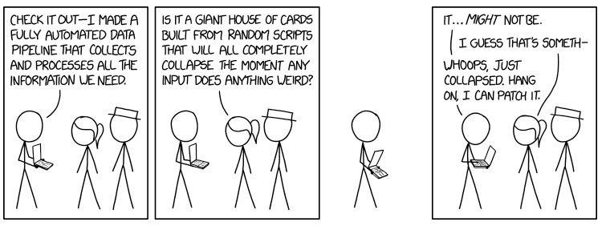

(plugin_developers_guide)=

# Plugin Developer's Guide

## Purpose of this document

Meeting the basic technical requirements of a plugin is straightforward. Simple examples include the [demo1](https://github.com/oicr-gsi/djerba/blob/GCGI-806_v1.0.0-dev/src/lib/djerba/plugins/demo1/plugin.py) and [demo2](https://github.com/oicr-gsi/djerba/blob/GCGI-806_v1.0.0-dev/src/lib/djerba/plugins/demo2/plugin.py) plugins in the main Djerba repository.

The goal of this document is to describe how to write a _useful_ plugin, to process production data for a clinical report. It outlines features of Djerba intended to make this easier:

*   Convenience methods and classes, eg. for manipulating INI config structures
*   Validation of output, to ensure it is correctly formatted

It also describes how and where to write the plugin code.

## Definitions

### What is a plugin?

A **plugin** works as a mini-Djerba:

*   Configure an INI file
*   Extract data to JSON
*   Render data as HTML

A plugin is a subclass of the Djerba [plugin base class](https://github.com/oicr-gsi/djerba/blob/GCGI-806_v1.0.0-dev/src/lib/djerba/plugins/base.py).

### Other definitions

*   **Core:** The Djerba framework to detect and run plugins. The core runs all relevant components to produce an INI file, JSON file, and HTML/PDF documents, similarly to classic Djerba.
*   **Workspace:** Shared directory in which we can write temporary files
*   **Merger**: A type of component which merges and deduplicates JSON from one or more plugins, to write HTML at the render step
*   **Helper**: A type of component which writes information to the workspace for use by other components, in the configure or extract steps
*   **Component**: Any sub-unit of Djerba: A plugin, merger, or helper. We can define multiple plugins, helpers, and mergers as needed.

## Identifiers

Each plugin must have a unique _identifier_. The identifier must be:

*   A valid [Python identifier](https://docs.python.org/3/reference/lexical_analysis.html#identifiers) – no special characters, spaces, reserved Python keywords, etc.
*   Unique to the plugin – not used by any other plugin, helper or merger
*   Not the string "core" which is reserved for Djerba core parameters

The identifier is:

*   The header for the INI file section corresponding to the plugin
*   The name of the directory containing the plugin code – which makes up a [Python package](https://docs.python.org/3/reference/import.html#packages)

Djerba relies on the identifier format to distinguish plugins, helpers, and mergers:

*   Helper identifiers **must** end with `_helper`. Conversely, any identifier ending with `_helper`  **must** be for a helper class.
*   Merger identifiers **must** end with `_merger`. Conversely, any identifier ending with `_merger`  **must** be for a merger class.
*   Plugin identifiers have no special requirements.

## Getting started: Files and directories

Every plugin is a [Python package](https://docs.python.org/3/reference/import.html#packages). In terms of the package hierarchy, it must be a subpackage of `djerba.plugins`.

To write a new plugin named `foo`:

1.  Make a directory `src/lib/djerba/plugins/foo` in the Djerba repository
2.  Create an empty file `src/lib/djerba/plugins/foo`/`__init__.py`
3.  Create a file `src/lib/djerba/plugins/foo`/`plugin.py` and make a subclass of the [plugin base class](https://github.com/oicr-gsi/djerba/blob/GCGI-806_v1.0.0-dev/src/lib/djerba/plugins/base.py)
4.  Override the `configure`, `extract`, and `render` methods of the base class as described below
5.  Write tests to check the plugin functions correctly  
    

Plugin code does not necessarily have to be in the main Djerba repository. It can be anywhere, as long as the plugin is a submodule of `djerba.plugins` and visible for import as a Python class (ie. the appropriate directory is on the PYTHONPATH environment variable).

## Configure step: The INI file structure

Djerba uses the [INI file format](https://en.wikipedia.org/wiki/INI_file#Example) for configuration. The INI parameters set out what information the plugin needs to do its job.

### Reserved parameters

Certain parameters are used by the Djerba core to control plugin behaviour. They must be present for all plugins.

#### Priorities

A plugin has three **priority** parameters: One each for the configure, extract, and render steps.

*   Priorities determine the order in which components are executed at runtime.
*   Priority values must be integers.
*   Components are executed starting with the lowest priority number, and ending with the highest.
*   The configure, extract, and render steps all have separate priorities, which may be set independently of each other.
*   Priority at the render step determines the order of sections in the HTML output document.
*   If two components have the same priority, the order in which they will run is not guaranteed. This may be acceptable for configure/extract, but is unlikely to be desirable for render.

Priority parameters are identified by the following keywords:

*   `configure_priority`
*   `extract_priority`
*   `render_priority`

These are reserved, and may not be used for any other INI parameters.

Priority tips and conventions

*   We set priorities in increments of 100 or more – this makes it easier to insert a priority in between two others, if needed later
*   If component A is dependent on component B, it is important to set the priorities so B runs before A
*   If there are no dependencies, the component still has a priority, but the value is unimportant

#### Attributes

Attributes can be thought of as tags applied to individual plugins. This enables core functions to categorize the plugins.

By default, known attributes are:

*   clinical
*   supplementary

The plugin INI may have an `attributes` parameter. The associated value may be empty; or one or more of the permitted attribute names, in any order, separated by commas. An incorrectly formatted attributes list will result in an error. Unknown attribute tags will result in a warning. The list of known attribute tags is set in the [component superclass `configurable`](https://github.com/oicr-gsi/djerba/blob/4014cb6bdd860dbf04e162c9a085bd39c6971787/src/lib/djerba/core/configure.py#L16) , and may be overridden in subclasses by setting the `KNOWN_ATTRIBUTES` class variable.

Similarly to the priority names, "attributes" is a reserved keyword, and may not be used for any other INI parameters.

When it parses a comma-separated list from an INI file, Djerba will automatically remove duplicates and sort the output. This applies to both attributes and dependencies (see below).

#### Dependencies

A plugin may depend on other plugins or helpers.

For example, a helper may write a data file to the workspace, which the plugin needs to do its analysis.

We can explicitly declare a dependency with INI parameters:

*   `depends_configure` 
*   `depends_extract`

at the configure and extract steps, respectively.

Each of these parameters may be empty; otherwise, it expects a comma-separated list of strings. A non-empty list contains the the identifiers of one or more plugins or helpers, in any order, separated by commas. At runtime, Djerba will check the list against the components in the INI file, and raise an error if a dependency is not present.

As with other reserved keywords, `depends_configure` and `depends_extract` may not be used for any other INI parameters.

##### "Depends" is not defined for mergers

There is no dependency INI parameter for mergers. In keeping with the Prime Directive of Rendering, all dependencies are resolved after the extract step is completed.

Similarly, a merger name should not appear in a dependency parameter.

##### "Depends" is not required

Plugin authors do not have to explicitly declare dependencies with the "requires" keyword. But doing so is recommended, as it allows additional error checking at runtime. (The alternative is _implicit_ dependency, where the onus is on whoever writes the INI file to make sure any dependencies are satisfied by running the needed components.)

### Plugin-specific parameters

Other INI parameters may be defined as needed. Parameters may have any name which is not a reserved keyword.

A **required** parameter must be supplied by the user.

A **default** parameter has a default value, which is read by the plugin code at runtime. Defaults may be recorded in any way which is convenient – hard-coded in the Python module, read from a file, etc.

All (non-reserved) parameters are either required or default, and must be defined as such in the plugin code. If the INI input contains parameters which have not been defined as required or default, an error will result.

### Substituting environment variables

Djerba supports setting INI parameters with environment variables. This is done by variable substitution using [Python template strings](https://docs.python.org/3/library/string.html#template-strings) and the mapping of environment variables from [Python os.environ](https://docs.python.org/3/library/os.html#os.environ).

For example:

*   Suppose `DJERBA_DATA_DIR`  is an environment variable with the directory path `/etc/data/djerba`; and an INI parameter has the value `$DJERBA_DATA_DIR/data_file.txt`
*   Then inside the `configure`  function, the plugin can substitute `$DJERBA_DATA_DIR` with the value of the corresponding environment variable
*   So in this case, the config parameter is changed from `$DJERBA_DATA_DIR/data_file.txt` to `/etc/data/djerba/data_file.txt` 

To do the variable substitution, simply call one of these methods inherited from the parent class `configurable` :

*   `apply_my_env_templates`  – applies only to the current component
*   `apply_env_templates` – applies to all components.  This breaks the convention that a plugin only modifies its own config section, so use with caution.

See the [template string documentation](https://docs.python.org/3/library/string.html#template-strings) for substitution rules. Note that Djerba uses `substitute` , not `safe_substitute` – so attempting to substitute an environment variable which does not exist will raise an error.

Environment variables and defaults

Environment variable substitution happens after defaults are applied – so it is permissible, and useful, for a default to have an environment variable to be filled in at runtime.


Environment variable conventions

We define some conventions for environment variables in Djerba:

*   `DJERBA_DATA_DIR` : Directory with data files, eg. Ensembl ID conversion table
*   `DJERBA_TEST_DIR` : Directory with shared files for unit tests
*   `DJERBA_PRIVATE_DIR` : Directory with restricted access permissions, used for files with private information such as passwords / access tokens

### Using the workspace

The workspace is a directory which can be used to read/write temporary files.

This enables data to be passed between components: A component can write a file, which is later read by another component. Doing so creates dependencies between components, which can be represented by correct use of priority values and the `depends`  parameters.

Every plugin has a [djerba.core.workspace](https://github.com/oicr-gsi/djerba/blob/GCGI-806_v1.0.0-dev/src/lib/djerba/core/workspace.py) object as an instance variable called `workspace`. Methods of the workspace class can be accessed in the usual way. For example, `self.workspace.read_string(my_file.txt)`  will return the contents of `my_file.txt`  as a string.

### Example INI section

In this example, we have all the INI parameters for `lego_movie_plugin`. Note that:

*   The `depends_extract` value is empty
*   `motto` , `lucky_number`, and `instructions`  are parameters specific to this plugin
*   `instructions`  uses environment variable substitution.
*   All reserved parameters required by the Djerba core are present.

  
```
[lego_movie_plugin]
configure_priority = 100
extract_priority = 100
render_priority = 100
attributes = clinical
depends_configure =
depends_extract = batman,star_wars
motto = "everything is awesome"
lucky_number = 42
instructions = $DJERBA_INSTRUCTION_DIR/instructions.pdf
```

### Implementation: How to write the code

#### How Djerba configuration works

At the configure step, we take a partially configured INI as input, and output a fully specified INI. The standard way in Python to handle an INI document is with a [ConfigParser](https://docs.python.org/3/library/configparser.html) object. The Djerba config step essentially consists of updating a ConfigParser into the form we want.

As noted above, a plugin is a subclass of the Djerba [plugin base class](https://github.com/oicr-gsi/djerba/blob/GCGI-806_v1.0.0-dev/src/lib/djerba/plugins/base.py). We implement the configuration for a plugin by overriding the `configure` and `specify_params` methods of the base class. [Method overriding](https://en.wikipedia.org/wiki/Method_overriding) is explained in detail in the [Python tutorial](https://docs.python.org/3/tutorial/classes.html) – but in short, we write a method with the same input and output arguments as the method of the same name in the parent class, but which may have different internal operations.

*   For `configure`, the input and output are both ConfigParsers
*   For `specify_params`, there is no input or output; instead, we call methods of the parent class to modify [instance variables](https://docs.python.org/3/tutorial/classes.html#class-and-instance-variables) (ie. the internal state of the plugin object).

At runtime, the Djerba core will call the `configure`  method of each plugin, giving it the ConfigParser output by the previous plugin, and expecting to receive back a ConfigParser with all parameters for the plugin completed. It does this for each component in priority order, completing the config section for each plugin, and so building up the complete INI document.

Editing convention

Input to the `configure`  method of each plugin is a ConfigParser with parameters for all components; but by convention, the plugin only edits its own section of the ConfigParser.

#### Configurable methods

The plugin base inherits from the core [configurable](https://github.com/oicr-gsi/djerba/blob/d6740d5bcbf2e242e3fba716fb3a1d1ce0d96578/src/lib/djerba/core/configure.py#L16) class, which contains a number of useful methods to support INI processing. 

Detailed documentation and examples are TODO, but method names/comments in the code itself should be instructive.

##### The `specify_params()` method

All plugins **must** define a method called `specify_params()`, which will be called by the `__init__()`  method of the base plugin class – in other words, it will be run when the plugin is loaded for use.

Any required and default parameters of the plugin **must** be defined in `specify_params()`. This is done using the following methods of the [configurable](https://github.com/oicr-gsi/djerba/blob/d6740d5bcbf2e242e3fba716fb3a1d1ce0d96578/src/lib/djerba/core/configure.py#L16) class:

*   `add_ini_required(name)` : Add a required parameter called `name` 
*   `set_ini_default(key, value)` : Add the given `(key, value)` pair as a default
*   `set_priority_defaults(priority)` : Set defaults for all relevant priorities to the non-negative integer `priority`

At a minimum, `specify_params()` **must** set priorities for the plugin, either individually using `set_ini_default` or all at once using `set_priority_defaults`.

All INI parameters **must** be defined as either required or default in `specify_params()`. Using an undefined parameter in the INI will result in a runtime error.

##### The config wrapper

The `get_config_wrapper` method provides a [config wrapper](https://github.com/oicr-gsi/djerba/blob/d6740d5bcbf2e242e3fba716fb3a1d1ce0d96578/src/lib/djerba/core/configure.py#L164) object customized for that plugin.

As the name suggests, a [config wrapper](https://github.com/oicr-gsi/djerba/blob/d6740d5bcbf2e242e3fba716fb3a1d1ce0d96578/src/lib/djerba/core/configure.py#L164) wraps around a ConfigParser to provide functions specific for a Djerba plugin.

For example, a wrapper obtained from `get_config_wrapper` is aware of the plugin name, and has methods like `get_my_integer(parameter_name)` to get the named integer from the current plugin's config section. Doing the same with a ConfigParser would require something like `get_integer(plugin_name, parameter_name)` which is less convenient.

Usage:

1.  `wrapper = self.get_config_wrapper(config)` gets a wrapper
2.  Use methods of the wrapper to get/set variables
3.  Finally, do `return wrapper.get_config()` to output the completed ConfigParser

##### The `apply_defaults()`  method

As the name suggests, this method populates the INI with any default values defined for the plugin. Defaults are defined in the `specify_params` method (see below).

If any defaults have been defined, the developer **must** call `apply_defaults`  in the `configure`  method of the plugin, in order to apply them to the INI at runtime.

Usage: `updated_config = self.apply_defaults(config)`

##### The `get_module_dir()`  method

This method returns a path to the directory where the plugin module has been installed. This is very useful for running additional code (eg. R scripts) or reading data files which may be part of the plugin.

Usage: `my_module_dir = self.get_module_dir()` 

#### Summary and checklist

To summarize, the way to write the configure step for a new plugin is:

1.  Make a subclass of the plugin base class.
2.  In the subclass, make a method called `specify_params`. Use the methods of the parent class to provide names of all required parameters, and names and values of all default parameters.
3.  In the subclass, make a method called `configure`, which will override the `configure`  method of the parent class. `configure` will take a ConfigParser as input, and return a ConfigParser as output.
4.  In the new `configure`  method, use `get_config_wrapper(config)`  to get a wrapper for the input ConfigParser.
5.  Write whatever code is needed to update values in the config.
    1.  All required parameters must receive values.
    2.  Default values may also be overwritten, depending on user input or the results of previously run plugins (eg. files read from the workspace).
    3.  Access the workspace as needed, using methods of `self.workspace`
6.  Do environment variable substitution if desired, by calling `apply_my_env_templates()`
7.  Use the `get_config()`  method of the config wrapper to get back an updated ConfigParser
8.  Finally, return the updated ConfigParser as output from the new `configure`  method.

## Extract step: From INI to JSON

### Overview

The extract step takes as input a fully specified INI configuration, and outputs a data structure to be written in JSON format. The output should contain **only** data specific to that plugin – it is a component of the final JSON output, not the entire document. (This contrasts with the configure step, where the input/output is a ConfigParser with parameters for all components.) The JSON output for a plugin should be self-contained, in accordance with the Prime Directive of Rendering.

At the extract step, components have priorities and can read/write files in the workspace, in exactly the same ways as the configure step.

### The JSON schema

#### What is a JSON schema?

Data output by a plugin must satisfy the plugin JSON schema.

A schema is a JSON document which specifies a permitted structure for _other_ JSON documents. JSON generated by a plugin is automatically validated against the schema.

JSON schema syntax is documented in the JSON schema [home page](https://json-schema.org/) and [tutorial](https://json-schema.org/understanding-json-schema/). Schema validation in Djerba is done using the Python [jsonschema](https://python-jsonschema.readthedocs.io/en/stable/) package.

#### The plugin schema

The [JSON schema document](https://github.com/oicr-gsi/djerba/blob/GCGI-806_v1.0.0-dev/src/lib/djerba/core/plugin_schema.json) for plugins is on Github. Required keys include:

*   `plugin_name`: Identifier of the plugin
*   `version`: Version of the plugin
*   `priorities`: Integers determining order at runtime
*   `attributes`: Keywords applied to this plugin
*   `required`: Comma-separated list of component names required by this component
*   `merge_inputs` : Input to mergers (if any), see below for details
*   `results` : Catch-all attribute to contain data produced by the plugin

The `priorities` , `attributes` , and `required` keys implement the respective concepts, already discussed for the configure step.

The `results`  value may contain any data produced by the plugin, so long as it can be represented in JSON: Text, additional data structures, base-64 encoded images, etc. (Very large results may cause issues with uploading to the Djerba CouchDB instance.)

#### The merge\_inputs key

Djerba merger components expect their input in a specific format. Therefore, each merger has its own JSON schema.

An example is the [gene information merger schema](https://github.com/oicr-gsi/djerba/blob/GCGI-806_v1.0.0-dev/src/lib/djerba/mergers/gene_information_merger/merger_schema.json). It expects an array of objects, each of which has key/value pairs for gene, gene URL, chromosome, and summary text.

The contents of the `merge_inputs`  value in plugin output are key/value pairs, where the key is the name of a merger, and the value is a data structure satisfying the merger schema.

### Implementation: How to write the code

1.  In the plugin subclass created for the `configure`  step, override the `extract`  method
2.  Input is a ConfigParser with all parameters fully specified
3.  Write code to extract the data for the given parameters
4.  Return a data structure satisfying the plugin JSON schema:
    1.  The overall structure must match the general plugin schema
    2.  Any entries in `merge_inputs`  must match the schema of the appropriate merger

## Render step: From JSON to HTML

The final step for a plugin is to render JSON output to HTML. (Conversion of HTML to PDF is done by the Djerba core.)

Once again, the plugin class must override the `render` method of the parent class. Input to `render` is the JSON data generated by the plugin in the extract step; and output is a string, intended to make up part of an HTML document.

The output string may be generated in any way that is convenient. The use of [Mako templates](https://www.makotemplates.org/) to interpolate JSON variables to HTML is strongly recommended, for consistency with other plugins.

The final HTML document will contain CSS style headers inserted by the Djerba core, similar to those used by [classic Djerba](https://github.com/oicr-gsi/djerba/blob/GCGI-806_v1.0.0-dev/src/lib/djerba/html/style.css). The CSS features can be used to ensure consistent formatting between report sections.  Explicitly defining CSS headers in core Djerba is TODO. 

### The Prime Directive of Rendering

JSON from each plugin is rendered **independently** of every other plugin.

It is an important principle of Djerba that the JSON document is self-contained; in other words, it is possible to generate a complete report using only the JSON document. In particular, we archive JSON to a database with the expectation that it can be rendered to an HTML document if desired.

To enable this, the JSON element for a plugin must be sufficient to generate HTML for that plugin. The render step cannot depend on output from other plugins (whether in the JSON document, or in the workspace).

Dependencies at the configure and extract steps are fine (and Djerba has extensive features to support this), but any dependencies must be resolved by the completion of the extract step.

### Do not use the workspace

The `workspace` attribute of the plugin can in theory be accessed at the render step. In practice, developers **must not** do this, as it will break the Prime Directive of Rendering. If data from the workspace is needed, it **must** be inserted into the JSON in the extract step.

## Testing a plugin

### A simple test class

Djerba provides a simple test framework for plugins in [plugin\_tester.py](https://github.com/oicr-gsi/djerba/blob/GCGI-806_v1.0.0-dev/src/lib/djerba/plugins/plugin_tester.py). As a bare minimum, each plugin should include the plugin tester.

An example can be seen in the [demo test](https://github.com/oicr-gsi/djerba/blob/GCGI-806_v1.0.0-dev/src/lib/djerba/plugins/demo1/test/plugin_test.py). Required steps are:

1.  Create a subdirectory `test`  within the plugin directory
2.  Create an empty file in the test directory named `__init__.py` 
3.  Create a file with an appropriate name like `plugin_test.py`
    1.  Start with a [shebang](https://realpython.com/python-shebang/) such as `#! /usr/bin/env python3`  to allow execution on the command line
    2.  Make a subclass of `djerba.plugins.plugin_tester` 
4.  Write INI and JSON files in the test directory, and [find the MD5 checksum](https://manpages.ubuntu.com/manpages/xenial/man1/md5sum.1.html) of the expected output
5.  Create a dictionary with the INI filename, JSON filename, and MD5 string
6.  Call the `run_basic_test` method of the parent class, with the plugin directory and the above dictionary as arguments
7.  The test can then be run as usual for a [Python unit test script](https://docs.python.org/3/library/unittest.html), directly or using [test discovery](https://docs.python.org/3/library/unittest.html#test-discovery)

The basic test will:

1.  Run `configure` with the given INI file as input
2.  Run `extract` with the fully specified INI file generated in the `configure` step
3.  Compare the JSON output of `extract` with the given JSON file, to ensure they match
4.  If step 3 is successful, run `render` with the JSON as input
5.  Compare the MD5sum of the string output by `render` with the given checksum, again ensuring they match

This is the simplest possible test of running a plugin from start to finish.

### Bootstrapping test development

**Bootstrap**, noun: The technique of starting with existing resources to create something more complex and effective.

The `generate_ini.py`  and main `djerba.py`  scripts can be used to do preliminary testing and prepare the INI and JSON inputs for the plugin tester.

1.  Write a first draft of the plugin
2.  Try to run `generate_ini.py` to create an INI file for the plugin and any dependencies. Fix any bugs in the initial draft which cause `generate_ini.py` to crash.
3.  Update the auto-generated INI file to run Djerba. At a minimum, fill in any parameters which must be specified manually; other parameters may also need to be modified for testing.
4.  Run `djerba.py` with the generate INI file to generate a report. Again, fix any crash-inducing bugs.
5.  Check the HTML/PDF output by eye. (Sometimes bugs occur silently but result in incorrect output.)
6.  Use your INI file, and the JSON generated by `djerba.py`, to provide inputs to the simple test class.
7.  Run the simple test. Update the expected MD5 sum for HTML output if necessary.

### Example of running a test

```bash
$ generate_ini.py --verbose -o test.ini provenance_helper patient_info
2023-08-02_17:06:45 djerba.core.ini_generator INFO: Generating config for components: ['core', 'provenance_helper', 'patient_info']
2023-08-02_17:06:45 djerba.core.ini_generator INFO: Finished generating config.
# edit test.ini and fix bugs
$ djerba.py report -i test.ini -o report -w work
```

### Further remarks on testing

Additional testing is **strongly encouraged!** See the Python [unittest documentation](https://docs.python.org/3/library/unittest.html) for details. Through testing, we seek to avoid the situation in this [XKCD cartoon](https://xkcd.com/2054/):

[](https://xkcd.com/2054/)

Also important for testing is the ability to think outside the box:

[](https://twitter.com/brenankeller/status/1068615953989087232)

## Conclusion

*   This document has set out instructions for how to write a Djerba plugin.
*   It is not intended to be exhaustive! Rather, it is meant as a reasonably compact tour of the essential plugin features.
*   Writing mergers and helpers is very similar to writing plugins, but not explicitly covered here.
*   Questions/comments/bug reports can be sent to the Djerba development team.
*   Happy coding!